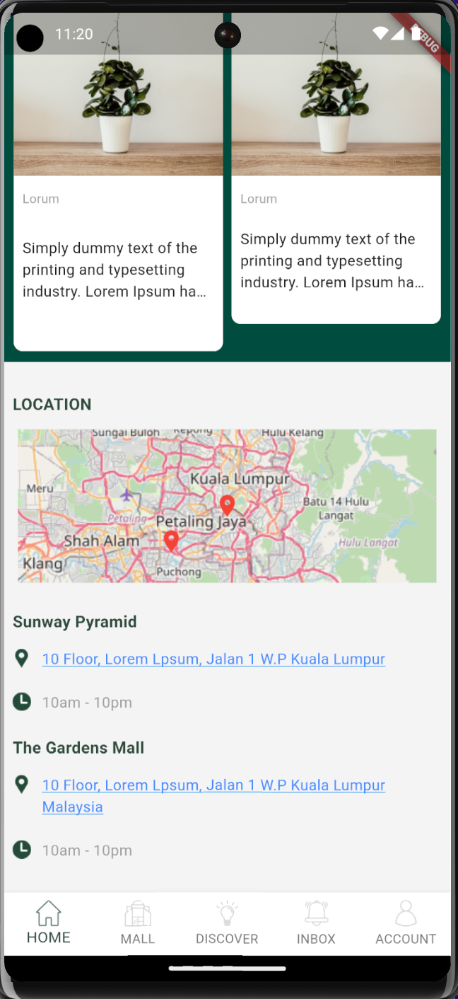

# my_flower

A flutter demo projects 

## How to run
- flutter run (main.dart as entry point)

## Flutter version
-  3.10.5

## State management
- Bloc

## Route management
- auto_route

## File structure
main.dart

app.dart 
- features
    - home
    - inbox
    - mall
    - account
    - discover
- core
    - constants
    - utils
    - widgets
- data 
- domain
  
service_locator.dart

## Useful command
- flutter pub run build_runner build --delete-conflicting-outputs

## Screenshot

## References/ Documentation
1. Localization: https://docs.flutter.dev/ui/accessibility-and-localization/internationalization
2. auto_route: https://pub.dev/packages/auto_route 

